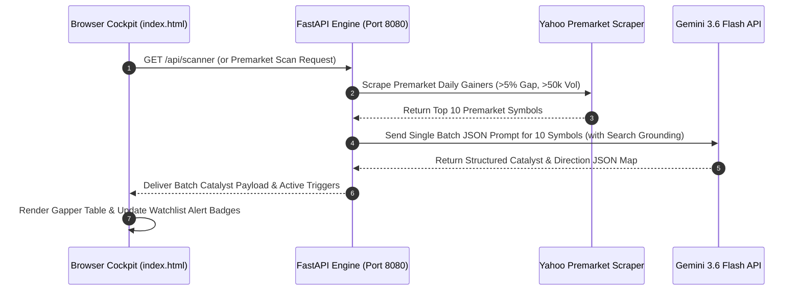
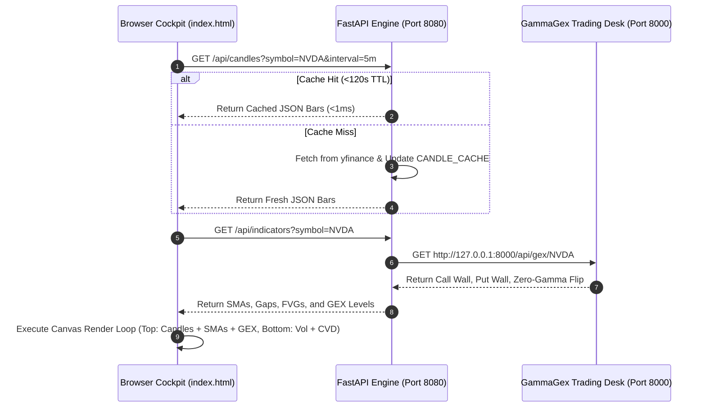
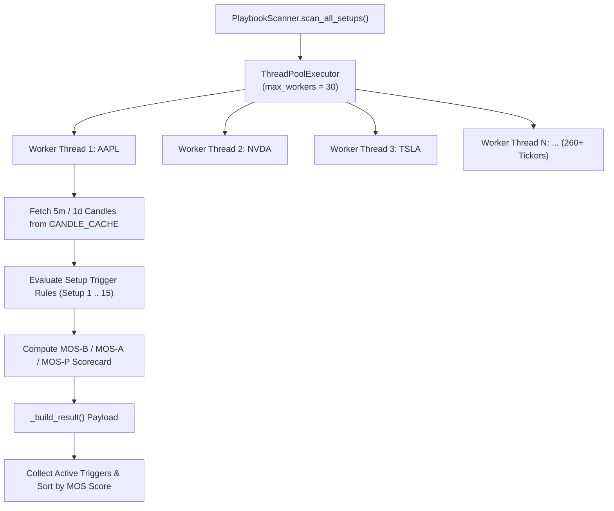

# Aether Market Terminal - System Architecture & Detailed Design Specification

**Document Version:** 2.0.0  
**Status:** Approved / Production-Current  
**Last Architectural Review:** September 2026  
**Target Audience:** Systems Architects, Quantitative Engineers, Frontend Developers  

---

## Document Revision History

| Version | Date | Author / Team | Summary of Changes |
| :--- | :--- | :--- | :--- |
| **v1.0.0** | July 2026 | Architecture Team | Initial architecture spec: single-page app, Node proxy, TradingView integration. |
| **v1.5.0** | August 2026 | Architecture Team | Multi-service architecture, Port 8080 isolation, central yfinance cache proxy. |
| **v2.0.0** | September 2026 | Lead Architect & Quant Team | Custom dual-pane canvas chart coordinate math, 30-worker thread parallel scanner, SQLite persistent journal schema, and backtest optimizer lab. |

---

## 1. System Architecture Overview & Topology

The **Aether Market Terminal** is built as a modular, microservice-oriented multi-process application. The system decouples UI presentation, news stream proxying, quantitative calculation services, and options volatility analytics into dedicated runtime processes.

```mermaid
graph TB
    subgraph Client Layer
        UI["Web Frontend Cockpit<br>(index.html)<br>Vanilla JS + Custom HTML5 Canvas"]
    end

    subgraph Service Layer (Port 8080)
        API["FastAPI Microservice Engine<br>(algo-engine/src/server.py)"]
        Cache["Central yfinance CANDLE_CACHE<br>(120s Memory TTL)"]
        Scanner["30-Thread Parallel Scanner<br>(calculations/scanner.py)"]
        Backtester["Backtest & Optimizer Lab<br>(backtester.py / optimizer.py)"]
        DB[("SQLite Database<br>(data/trading_system.db)")]
    end

    subgraph External Proxy Layer (Port 3000)
        NodeProxy["Node.js RSS Proxy Server<br>(proxy-server.js)"]
    end

    subgraph Options Desk Ecosystem (Port 8000)
        GexDesk["GammaGexTrading Engine<br>(Gamma GEX Server)"]
    end

    subgraph Third-Party Data Sources
        YF["Yahoo Finance API / Scraper"]
        Gemini["Google Gemini 3.6 Flash API<br>(Search Grounded Batch Prompt)"]
        RSS["Institutional RSS XML Feeds<br>(NAAIM / AAII)"]
        Alpaca["Alpaca Paper Trading REST API"]
    end

    UI -- "REST / JSON Queries" --> API
    UI -- "XML RSS Requests" --> NodeProxy
    API -- "Fetch Price Bars" --> YF
    API -- "Batch Catalyst Prompt" --> Gemini
    API -- "Cross-Query GEX Levels" --> GexDesk
    API -- "Read / Write Trade Journal" --> DB
    API -- "Sync API Keys" --> Alpaca
    NodeProxy -- "CORS Bypass SSL Fetch" --> RSS
    API --> Cache
    API --> Scanner
    API --> Backtester
```

---

## 2. Sequence Diagrams & End-to-End Data Flows

### A. Premarket Catalyst & Batch AI Processing Flow



### B. Charting & Indicators Rendering Flow



---

## 3. Component Detailed Design Specifications

---

### Component A: Web Frontend Cockpit (`index.html`)

**Architectural Role:** Single-Page Application (SPA) providing the user interface, custom interactive charting canvas, AI briefing cards, scanner cockpits, and journal sidebar.

#### Internal Subsystems
1.  **Centralized Model Resolution Manager (`getActiveGeminiModel`)**:
    Sanitizes user model selection stored in `localStorage`. Automatically migrates legacy keys to `gemini-3.6-flash`.
2.  **HTML5 Canvas Dual-Pane Charting Engine**:
    *   *Direct Pixel Manipulation:* Uses HTML5 2D Canvas context rendering for maximum frame-rate performance.
    *   *Top Pane Math (72% height):* Maps price values to Y-coordinates:
        $$Y_{\text{pixel}} = H_{\text{pane}} - \left( \frac{\text{Price} - \text{Price}_{\text{min}}}{\text{Price}_{\text{max}} - \text{Price}_{\text{min}}} \right) \times H_{\text{pane}}$$
        Applies a 2% vertical bounds expansion factor to ensure GEX lines never hit canvas boundaries.
    *   *Bottom Pane Math (23% height):* Renders volume bars and calculates Cumulative Volume Delta (CVD) running totals:
        $$\text{CVD}_t = \text{CVD}_{t-1} + \begin{cases} +\text{Volume}_t & \text{if } \text{Close}_t \ge \text{Open}_t \\ -\text{Volume}_t & \text{if } \text{Close}_t < \text{Open}_t \end{cases}$$
    *   *Fair Value Gap (FVG) Detector:* Renders semi-transparent rectangle overlays spanning 3-candle imbalance ranges.
3.  **UI State & LocalStorage Synchronization**:
    Persists active watchlist selections, chart intervals, layout tab preferences, and API key credentials locally.

---

### Component B: Node.js RSS & CORS Bypass Proxy (`proxy-server.js`)

**Architectural Role:** Lightweight HTTP middleware operating on Port 3000 to bypass browser Same-Origin Policy (CORS) and SSL validation issues when requesting external XML sentiment feeds.

#### Key Implementation Details
*   **Server Core**: Standard Node.js `http` and `https` native modules (zero heavy framework overhead).
*   **SSL Certificate Handling**: Configured with `rejectUnauthorized: false` to allow fetching RSS streams from domain servers (e.g., `naaim.org`, `aaii.com`) that possess self-signed or non-standard SSL certificates.
*   **In-Memory Response Caching (`cache`)**: Maintains a 120,000 ms (2-minute) TTL cache keyed by target URL to prevent external feed spamming.
*   **Endpoints**:
    *   `GET /ping`: Health-check endpoint returning `{"status": "ok"}`.
    *   `GET /proxy?url=[RSS_URL]`: Proxy endpoint fetching and streaming XML feed text with `Access-Control-Allow-Origin: *` headers.

---

### Component C: Python FastAPI Microservice Backend (`algo-engine/src/server.py`)

**Architectural Role:** Primary application microservice operating on Port 8080. Serves backend endpoints for data proxying, technical indicator calculations, database persistent journaling, strategy scanning, and backtesting.

#### Key Endpoint Architecture

| Method | Route | Description | Query Parameters / Payload |
| :--- | :--- | :--- | :--- |
| `GET` | `/ping` | Health-check endpoint. | None. |
| `GET` | `/` | Serves the production web application (`index.html`). | None. |
| `GET` | `/api/candles` | Centralized yfinance candle proxy with 120s memory cache. | `symbol` (str), `interval` (str). |
| `GET` | `/api/indicators` | Computes SMAs, unmitigated gaps, FVGs, and cross-queries GEX levels. | `symbol` (str). |
| `GET` | `/api/scanner` | Executes 30-thread parallel scan across 260+ tickers for 15 setups. | None. |
| `GET` | `/api/metrics` | Returns current market metrics and system status. | `symbol` (str). |
| `GET` | `/api/backtest` | Runs historical bar simulation for selected setup. | `symbol`, `setup_id`, `start_date`, `end_date`. |
| `GET` | `/api/optimize` | Runs grid-search parameter sweep optimization. | `symbol`, `setup_id`, `start_date`, `end_date`. |
| `GET` | `/api/journal` | Retrieves paginated saved trade journal logs from SQLite. | `page` (int), `limit` (int). |
| `POST` | `/api/journal` | Creates a new persistent trade log entry in SQLite. | JSON payload (`symbol`, `setup_id`, `score`, etc.). |
| `POST` | `/api/journal/update` | Updates trade status (`Win`, `Loss`, `Pending`) in SQLite. | JSON payload (`id`, `status`). |
| `GET` | `/api/settings` | Reads Alpaca API key configuration from disk. | None. |
| `POST` | `/api/settings` | Saves Alpaca API keys to `config/alpaca_config.json`. | JSON payload (`key_id`, `secret_key`). |

---

### Component D: Mathematical & Calculation Engines

#### 1. Volume Signature Engine (`calculations/rvol.py`)
*   **Time-Slice Premarket RVOL ($RVOL_{TS}$)**:
    $$RVOL_{TS} = \frac{\text{Cumulative Premarket Vol}_{\text{Today}}}{\frac{1}{20} \sum_{d=1}^{20} \text{Cumulative Premarket Vol}_d}$$
*   **Regular Hours Time-Slice RVOL ($RVOL_{RM}$)**:
    $$RVOL_{RM}(t) = \frac{\text{Bar Volume}(t)}{\frac{1}{20} \sum_{d=1}^{20} \text{Bar Volume}_d(t)}$$
*   **Volume Acceleration ($Acc_{Vol}$)**:
    $$Acc_{Vol}(t) = \frac{\text{Bar Volume}(t)}{\frac{1}{5} \sum_{i=1}^{5} \text{Bar Volume}(t-i)}$$

#### 2. Options Gamma Boundaries Engine (`calculations/gex.py`)
Calculates net dollar gamma per strike and extracts key boundary levels:
$$\text{Net Gamma}_{\text{Strike}} = \left( \text{OI}_{\text{Call}} \times \Gamma_{\text{Call}} - \text{OI}_{\text{Put}} \times \Gamma_{\text{Put}} \right) \times S^2 \times 0.01$$
*   `Call Wall` = $\arg\max_{\text{Strike}} (\text{Net Gamma}_{\text{Strike}})$
*   `Put Wall` = $\arg\min_{\text{Strike}} (\text{Net Gamma}_{\text{Strike}})$
*   `Zero-Gamma Flip` = Interpolated strike where Net Gamma transitions from positive to negative.

#### 3. Technical Indicators & Imbalance Engine (`calculations/indicators.py`)
*   **Unmitigated Gaps**: Detects overnight price gaps where $High_{d-1} < Low_d$ or $Low_{d-1} > High_d$ that have not been intersected by subsequent price action.
*   **Fair Value Gaps (FVG)**:
    $$\text{Bullish FVG}_t = \left[ High_{t-2}, Low_t \right] \quad \text{where } Low_t > High_{t-2}$$
    $$\text{Bearish FVG}_t = \left[ High_t, Low_{t-2} \right] \quad \text{where } High_t < Low_{t-2}$$

---

### Component E: Setup Registry & Parallel Scanner (`calculations/scanner.py`)

**Architectural Role:** Multi-threaded parallel scanner executing setup rules and scorecards.



*   **Strategy Base Class (`BaseSetup`)**: Defines standard interface for all 15 setups:
    ```python
    class BaseSetup:
        def __init__(self, params: dict):
            self.params = params
        def check_trigger(self, df: pd.DataFrame) -> bool:
            raise NotImplementedError
        def calculate_mos(self, df: pd.DataFrame) -> float:
            raise NotImplementedError
    ```

---

### Component F: Strategy Simulation & Optimization Subsystem (`backtester.py`, `optimizer.py`)

**Architectural Role:** Backtesting execution engine and grid-search optimizer.

#### Simulation Loop Design (`PlaybookBacktester`)
1.  Iterates sequentially through historical daily/intraday price bars.
2.  Evaluates `check_trigger(bar)` for selected setup ID.
3.  If triggered, sizes position using `get_risk_allocation(mos_score)`.
4.  Monitors bar-by-bar price action against Stop Loss and Profit Targets.
5.  Executes **partial exit logic**:
    *   At Target 1 (1.5R): Sells 50% size, adjusts Stop Loss to entry price.
    *   At Target 2 (3.0R): Sells remaining 50% size.
6.  Logs trade metrics to detailed execution summary dictionary.

#### Grid-Search Parameter Sweep (`SetupParameterOptimizer`)
Iterates across parameter arrays (e.g., $RVOL \in [1.0, 1.5, 2.0, 2.5]$, $\text{Target} \in [1.5, 2.0, 3.0, 4.0]$), executing backtests for each permutation and isolating the parameters that maximize net returns and profit factor.

---

### Component G: Database Entity-Relationship Schema (`trading_system.db`)

**Database Engine:** SQLite 3  
**Database File Location:** `algo-engine/data/trading_system.db`  

#### `journal_entries` Table Definition

```sql
CREATE TABLE IF NOT EXISTS journal_entries (
    id INTEGER PRIMARY KEY AUTOINCREMENT,
    symbol TEXT NOT NULL,
    timestamp TEXT NOT NULL,
    setup_id TEXT NOT NULL,
    setup_name TEXT NOT NULL,
    score REAL NOT NULL,
    metrics TEXT NOT NULL,          -- JSON string of metrics
    breakdown TEXT NOT NULL,        -- JSON string of scorecard points
    risk_parameters TEXT NOT NULL,  -- JSON string of risk sizing
    status TEXT DEFAULT 'pending',  -- 'win', 'loss', 'pending'
    direction TEXT DEFAULT 'long',  -- 'long', 'short'
    setups_json TEXT DEFAULT '[]',   -- JSON array of all active setups
    setup_count INTEGER DEFAULT 1,
    confluence_score REAL DEFAULT 0.0,
    timeframe TEXT DEFAULT '5m'
);
```

---

## 4. Genesis Design System Guidelines & Visual Tokens

The frontend dashboard adheres strictly to the **Genesis Design System** guidelines defined in `genesis-DESIGN.md`:

```
+---------------------------------------------------------------------------------------------+
|  PRIMARY: #6366F1 (Indigo)    |  HOVER: #4F46E5               |  SECONDARY: #20970B (Green) |
|  BACKGROUND: #FAFAFA          |  SURFACE: #FFFFFF             |  BORDER: #E8E8EC            |
|  TEXT PRIMARY: #0A0A0A        |  TEXT SECONDARY: #6B6B6B      |  NEUTRAL: #9C9C9C           |
+---------------------------------------------------------------------------------------------+
```

### Color Token Palette

| Token Name | Hex Code | Applied Usage |
| :--- | :--- | :--- |
| **Primary** | `#6366F1` | CTAs, active tab highlights, focus rings, interactive highlights (Indigo). |
| **Primary Hover** | `#4F46E5` | Hover state for primary buttons and active controls. |
| **Secondary** | `#20970B` | Exclusively reserved for brand highlights. |
| **Background** | `#FAFAFA` | Page background color (light warm gray). |
| **Surface** | `#FFFFFF` | Cards, modal surfaces, panel overlays. |
| **Text Primary** | `#0A0A0A` | Headings, primary metrics, active text labels (near-black). |
| **Text Secondary** | `#6B6B6B` | Descriptions, secondary labels, metadata text. |
| **Border** | `#E8E8EC` | Subtle card borders, input borders, dividers. |
| **Success** | `#10B981` | Positive P&L, green candlesticks, winning trades. |
| **Warning** | `#F59E0B` | Pending status, setup warning alert badges. |
| **Error** | `#EF4444` | Negative P&L, red candlesticks, losing trades, stop-loss lines. |

---

### Typography Hierarchy

*   **Display Font**: *General Sans* (Bold weight, tight letter spacing `-0.03em` to `-0.04em`). Used for main headers and key metric values.
*   **Body Font**: *DM Sans* (Regular and Medium weights). Used for descriptions, table contents, and UI text.
*   **Code Font**: *JetBrains Mono* (Regular weight). Used for API parameters, code snippets, ticker symbols, and timestamp badges.

---

### Elevation & Component Rules

*   **Flat Elevation & Subtle Borders**: Cards rest flat with a `1px` border (`#E8E8EC`) and `12px` border radius (`rounded-xl`).
*   **Hover Lift Effect**: Cards lift vertical offset by `-2px` on hover with a subtle shadow (`0 8px 30px rgba(0,0,0,0.08)`).
*   **Buttons**: `6px` border radius (`rounded-md`). Primary buttons use indigo fill with white text. Shifting `-1px` on hover.
*   **Input Fields**: `6px` radius, `1px` subtle border, focus state triggers a `3px` indigo ring (`0 0 0 3px rgba(99,102,241,0.12)`).
*   **Navigation Bar**: Sticky top navigation with backdrop blur (`backdrop-blur-md`) and `1px` bottom border.
