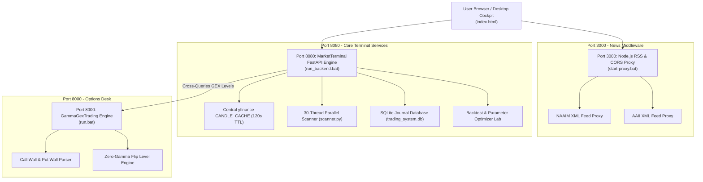

# Aether Market Terminal - Full Functional Specification & Strategic Product Roadmap

**Document Version:** 2.0.0  
**Status:** Approved / Production-Current  
**Last Architectural Review:** September 2026  
**System Domain:** News/Catalyst, Macro & Sentiment, Options Gamma GEX, Momentum Algorithmic Trading  

---

## Document Revision History

| Version | Date | Author / Team | Summary of Changes |
| :--- | :--- | :--- | :--- |
| **v1.0.0** | July 2026 | Product & Quant Team | Initial functional spec: News catalysts, macro sentiment, and paper trade execution. |
| **v1.5.0** | August 2026 | Quant Engineering | Added specifications for 15 momentum setups, RVOL metrics, and backtest optimizer. |
| **v2.0.0** | September 2026 | Lead Architect & Quant Team | Full production spec: Custom dual-pane canvas chart, 30-thread parallel scanner, SQLite persistent journal, and watchlist warning badges. |

---

## 1. Executive Summary & Product Vision

The **Aether Market Terminal** is a high-density, multi-threaded algorithmic trading workstation engineered for active momentum traders, quantitative analysts, and portfolio managers. The system synthesizes quantitative market micro-structure signatures (relative volume pacing, option gamma boundaries, price consolidation parameters) with real-time news catalyst discovery, AI-grounded sentiment analysis, and systemic macro indicators.

The platform operates as a hybrid workstation, coupling a high-performance, single-page web cockpit (`index.html`) rendered with vanilla JavaScript and custom HTML5 canvas charting with a Python microservice engine (`algo-engine/`) and Node.js proxy middleware (`proxy-server.js`).

### Core System Capabilities
1. **Real-Time Catalyst Discovery & News Grounding**: Instant extraction of pre-market gappers and top in-play equities, powered by Gemini 3.6 Flash batch processing with Google Search Grounding.
2. **Systemic Macro & Sentiment Divergence Tracking**: Real-time cross-analysis of retail sentiment (AAII), institutional exposure (NAAIM), fund flow Z-scores, and institutional vs. retail sentiment divergence.
3. **Options Gamma GEX Desk Integration**: Automated tracking and overlay of Call Walls, Put Walls, and Zero-Gamma Flip levels directly on candlestick charts via microservice cross-queries.
4. **15-Setup Quantitative Momentum Playbook**: Modular setup trigger evaluation, time-slice relative volume ($RVOL_{TS}$, $RVOL_{RM}$), volume pacing acceleration ($Acc_{Vol}$), and tailored Opportunity Scorecards (MOS-B, MOS-A, MOS-P).
5. **High-Speed Parallel Multi-Threaded Scanner**: 30-worker thread execution scanning 260+ high-liquidity tickers across all 15 setups in under 10 seconds.
6. **Strategy Backtesting & Grid-Search Optimization**: Historical bar-by-bar strategy backtester (`backtester.py`) and multi-parameter sweep optimizer (`optimizer.py`).
7. **Persistent SQLite Execution Journal & Portfolio Manager**: SQLite database persistence (`trading_system.db`), paginated journal logs, status toggling, and watchlist warning badges.

---

## 2. System Architecture & Multi-Port Ecosystem

The terminal operates across three coordinated microservice ports to ensure high performance, isolation of concerns, and resilience against API rate limiting:



### System Port Registry

| Service | Port | Endpoint URL | Responsibilities |
| :--- | :--- | :--- | :--- |
| **MarketTerminal Engine** | `8080` | `http://127.0.0.1:8080` | Serves Web UI, central yfinance proxy, indicators engine, universal scanner, SQLite journal DB, and backtester. |
| **GammaGexTrading Desk** | `8000` | `http://127.0.0.1:8000` | Options chain GEX calculations, call/put wall detection, zero-gamma flip boundary computation. |
| **Node RSS Proxy** | `3000` | `http://127.0.0.1:3000` | CORS bypass proxy for institutional sentiment RSS/XML feeds (NAAIM, AAII). |

---

## 3. Comprehensive Functional Module Inventory

The system consists of seven fully implemented functional modules:

```
+---------------------------------------------------------------------------------------------+
|  MODULE 1: News & Catalyst  |  MODULE 2: Macro & Sentiment  |  MODULE 3: Canvas Charting   |
+---------------------------------------------------------------------------------------------+
|  MODULE 4: Options GEX Desk |  MODULE 5: Playbook Scanner   |  MODULE 6: Backtest / Opt Lab|
+---------------------------------------------------------------------------------------------+
|  MODULE 7: Trade Execution, Portfolio & SQLite Journaling System                            |
+---------------------------------------------------------------------------------------------+
```

---

### Module 1: News & Catalyst Intelligence Engine

**Overview:** Identifies equities experiencing anomalous catalyst-driven price movements and provides qualitative news context.

#### Functional Specifications
*   **Premarket Gappers Scanner**: Automatically scrapes Yahoo Finance daily gainers pre-market, filtering for equities with price gap $> 5\%$ and volume $> 50,000$ shares.
*   **Batch AI Catalyst Processing (`gemini-3.6-flash`)**: Replaces sequential single-ticker requests with a single parallel prompt sent to Gemini 3.6 Flash with Google Search Grounding. Processes 10 tickers simultaneously, returning structured JSON containing catalyst summaries and price direction (rising/falling).
*   **Case-Insensitive Multi-Feed News Stream**: Aggregates news from Google News, Yahoo Finance, WSJ, CNBC, and Reddit. Search filters evaluate titles, descriptions, badges, and tickers in a case-insensitive manner.
*   **Google News Direct Bypass**: Bypasses local UI keyword filtering when the `GOOGLE` feed tab is active to preserve semantic search relevance.
*   **XML Parsing Fallback Pipeline**: Secondary backup parser that processes raw RSS XML streams if AI API requests hit rate limits.

---

### Module 2: Macro & Sentiment Divergence Desk

**Overview:** Evaluates broader market positioning, fund manager exposure, retail sentiment, and AI-driven stock evaluations.

#### Functional Specifications
*   **Retail vs. Institutional Sentiment Divergence Meter**: Cross-references retail sentiment (Reddit/AAII) against institutional news coverage (WSJ/CNBC). Flags high-probability bull traps when retail is hyper-bullish while institutions distribute.
*   **NAAIM Exposure Index Tracker**: Fetches and parses the National Association of Active Investment Managers (NAAIM) exposure index via the Port 3000 proxy. Tracks fund manager leverage (<30% oversold/hedged, >100% fully leveraged/risk-off).
*   **AAII Retail Sentiment Survey**: Tracks American Association of Individual Investors (AAII) Bullish/Bearish ratios. Treats Bullish >50% as a contrarian top signal and Bearish >50% as a bottoming buy signal.
*   **Weekly ETF Fund Flow Z-Score Engine**: Calculates standardized Z-scores (-1.5 to +1.5) for equity and fixed-income ETF flows, identifying crowded trade exhaustion or capitulation reversals.
*   **Systemic Macro Index (SMI)**: Normalized composite metric blending VIX volatility regimes with survey positioning data.
*   **Gemini Institutional Analyst (3-Sentence Briefing)**: Formulates an instant 3-sentence qualitative assessment for any selected ticker:
    *   *Sentence 1 (Momentum):* Identifies institutional accumulation vs. retail distribution.
    *   *Sentence 2 (Risk):* Identifies critical technical risk levels for stop-loss placement.
    *   *Sentence 3 (Catalysts/Targets):* Highlights upside target zones for profit taking.

---

### Module 3: Quantitative Technical & Canvas Charting Engine

**Overview:** High-density, split-pane HTML5 Canvas candlestick and technical indicator rendering engine with automated backend fallback.

#### Functional Specifications
*   **Split-Pane Canvas Architecture**:
    *   *Top Pane (72% height):* Candlestick wicks/bodies, Simple Moving Averages (20 SMA Blue, 50 SMA Orange, 200 SMA Purple), Call Wall, Put Wall, Zero-Gamma Flip line overlays.
    *   *Bottom Pane (23% height):* Volume bars color-coded by transaction direction (Green vs. Red) and RVOL intensity (Low, Standard, Trigger, Climax), overlaid with a cyan **Cumulative Volume Delta (CVD)** pressure line.
*   **Unmitigated Gaps & Fair Value Gaps (FVG)**:
    *   *Unmitigated Price Gaps:* Highlights unfilled gap zones extending from formation date to the current margin.
    *   *Fair Value Gaps (FVG):* Identifies 3-candle imbalance structures (Bullish FVG: Low of Candle 3 > High of Candle 1; Bearish FVG: High of Candle 3 < Low of Candle 1).
*   **Dynamic Price Bounds & Y-Axis Scaling**: Automatically expands canvas vertical bounds by 2% to ensure Call/Put Walls and GEX Flip lines are never visually clipped. Displays 5 distinct horizontal price grid labels.
*   **Client-Side Fallback Indicator Math**: Computes SMAs, unmitigated gaps, and FVGs directly in JavaScript if the backend Python microservice is offline.

---

### Module 4: Options GEX & Volatility Boundaries Desk

**Overview:** Quantifies options market maker positioning and identifies key pin/reversal levels.

#### Functional Specifications
*   **Cross-Desk Microservice Integration**: Port 8080 cross-queries the GammaGexTrading microservice on Port 8000 (`/api/gex/{symbol}`) for option wall levels.
*   **Local GEX Calculation Engine (`gex.py`)**: Secondary Python engine calculating net gamma per strike:
    $$\text{GEX}_{\text{Strike}} = \text{OpenInterest}_{\text{Call}} \times \Gamma_{\text{Call}} \times S^2 \times 0.01 - \text{OpenInterest}_{\text{Put}} \times \Gamma_{\text{Put}} \times S^2 \times 0.01$$
*   **Key Level Extractions**:
    *   *Call Wall:* Strike with maximum positive call gamma (acts as institutional resistance/magnet).
    *   *Put Wall:* Strike with maximum negative put gamma (acts as institutional support/floor).
    *   *Zero-Gamma Flip Level:* Price level separating positive gamma regime (volatility dampening) from negative gamma regime (volatility acceleration).

---

### Module 5: Playbook Scanner & Setup Registry

**Overview:** Implements the 15-setup momentum trading playbook, tailored scoring rubrics, and high-speed parallel scanning.

#### Functional Specifications

##### The 15 Playbook Setups
1.  **Setup 1: Gap & Go (Bullish Breakout)** - Premarket gap >5%, $RVOL_{TS} > 2.0$, green 5m opening range breakout.
2.  **Setup 2: Gap & Fade (Bearish Reversal)** - Premarket gap >5%, low volume/no catalyst, breakdown below 5m ORL.
3.  **Setup 3: Episodic Pivot (EP)** - Gap >8% on historic volume (>5x avg), major structural catalyst, 50-day high breakout.
4.  **Setup 4: Premarket High Breakout** - Consolidation below PMH followed by volume expansion breakout.
5.  **Setup 5: First Pullback to VWAP / 9-EMA** - Initial trend pullback holding VWAP or 9-EMA on declining volume.
6.  **Setup 6: Red-to-Green (R2G) Reversal** - Intraday reversal from negative to positive price change.
7.  **Setup 7: Volatility Contraction Pattern (VCP) Breakout** - Multi-week tightening range with contracting volume, breaking pivot.
8.  **Setup 8: High-Tight Flag (HTF)** - 100%+ advance in <8 weeks, consolidating <25% drop, breaking flag resistance.
9.  **Setup 9: Flat Top Breakout** - Multiple equal daily high rejections followed by volume breakout.
10. **Setup 10: Parabolic Short / Climax Reversal** - Vertical multi-day rally, $RVOL > 4.0$, upper wick rejection.
11. **Setup 11: Micro-VCP Intraday Breakout** - 5-minute time-frame volatility contraction leading to explosive move.
12. **Setup 12: Standard Opening Range Breakout (ORB)** - 15-minute range breakout with time-slice $RVOL_{RM} > 1.5$.
13. **Setup 13: "Blue Sky" All-Time High (ATH) Breakout** - Clear breakout above historical all-time high with zero overhead resistance.
14. **Setup 14: Stage 1 to Stage 2 Trend Reversal** - Base breakout above 200-day SMA marking new uptrend initiation.
15. **Setup 15: Post-Earnings Announcement Drift (PEAD)** - Consolidation breakout 2-5 days after strong earnings beat.

##### Volume Signature Mathematics (`rvol.py`)
*   **Time-Slice Premarket RVOL ($RVOL_{TS}$)**: Compares current cumulative premarket volume to 20-day historical average premarket volume at the exact same minute offset.
*   **Regular Hours Time-Slice RVOL ($RVOL_{RM}$)**: Compares intraday bar volume to historical average volume for that specific 5-minute interval to eliminate U-curve distortion.
*   **Volume Acceleration ($Acc_{Vol}$)**: Measures volume surge within a single bar relative to trailing 5-bar moving average volume.

##### Tailored Opportunity Scorecards (`scorecards.py`)
Computes normalized 0-10 Opportunity Scores using specialized weighted rubrics:
*   **MOS-B (Breakout Scorecard)**: 30% Catalyst, 25% RVOL, 20% Technical Pattern, 15% GEX Regime, 10% Macro Alignment.
*   **MOS-A (Volatility Contraction Scorecard)**: 35% Tightness/Base Duration, 25% Volume Contraction Ratio, 20% Catalyst, 10% GEX, 10% Macro.
*   **MOS-P (Pullback Scorecard)**: 35% Moving Average/VWAP Support Confluence, 25% Volume Reduction on Pullback, 20% Catalyst, 10% GEX, 10% Macro.

##### High-Speed 30-Thread Parallel Scanner (`scanner.py`)
*   Uses Python `ThreadPoolExecutor` with 30 concurrent workers.
*   Scans **260+ high-liquidity tickers** (S&P 100 leaders, Nasdaq 100, liquid tech/retail momentum stocks) across all 15 setups.
*   Execution latency: **< 10 seconds** for full universe scan.

---

### Module 6: Playbook Backtest & Parameter Optimization Lab

**Overview:** Quantitative testing engine for evaluating playbook strategies against historical price bars and tuning entry/exit parameters.

#### Functional Specifications
*   **Historical Simulation Engine (`backtester.py`)**: Simulates bar-by-bar execution, entry triggers, MOS scorecard risk sizing, and position tracking.
*   **Multi-Stage Partial Exit Execution**:
    *   *Partial Target 1:* Sells 50% of position at specified risk multiple (e.g., 1.5R or 2.0R) and automatically moves stop-loss to breakeven.
    *   *Partial Target 2:* Sells remaining 50% at final profit target (e.g., 3.0R) or trails stop along key moving averages (10 EMA, 21 EMA, 50 SMA).
*   **Grid-Search Parameter Sweep Optimizer (`optimizer.py`)**: Iterates across combinations of RVOL thresholds ($1.0$ to $3.0$) and profit targets ($1.5\text{R}$ to $4.0\text{R}$), returning the optimal parameters based on Net Profit, Win Rate, and Profit Factor.

---

### Module 7: Trade Execution, Portfolio & SQLite Journaling System

**Overview:** Risk-sized order execution management, portfolio holdings tracking, persistent trade database, and real-time UI alerting.

#### Functional Specifications
*   **Dynamic MOS Risk Allocation**:
    *   $\text{MOS} \ge 8.5$: High Conviction → Risk $2.0\%$ of equity.
    *   $7.0 \le \text{MOS} < 8.5$: Moderate Conviction → Risk $1.0\%$ of equity.
    *   $5.0 \le \text{MOS} < 7.0$: Low Conviction → Risk $0.5\%$ of equity.
    *   $\text{MOS} < 5.0$: No Trade / Disqualified.
*   **Persistent SQLite Journal Database (`trading_system.db`)**: Stores full trade lifecycle logs in the `journal_entries` table. Auto-seeds 5 high-fidelity historical logs if empty.
*   **Dynamic Schema Migration Handler**: Automatically detects and migrates database schemas to include `direction`, `setups_json`, `setup_count`, `confluence_score`, and `timeframe` columns.
*   **Paginated Journal & Status Management**: UI sidebar provides pagination controls (◀ Page ▶) and instant status toggling (`Win`, `Loss`, `Pending`) saved directly to SQLite.
*   **Watchlist Setup Warning Badges**: Displays real-time alert badges (e.g., `⚠️ 2 (8.5)`) next to tickers across all watchlists, indicating active trigger count and highest MOS score.

---

## 4. Product Roadmap & Strategic Milestones

The product development roadmap is organized into four distinct completed and planned engineering milestones:

```mermaid
gantt
    title Aether Market Terminal Development Roadmap
    dateFormat  YYYY-MM-DD
    section Phase 1 & 2
    Milestone 1: Data Engine & Calculations         :done, m1, 2026-06-01, 2026-06-30
    Milestone 2: Scanners, Scorecards & Backtesting  :done, m2, 2026-07-01, 2026-07-31
    section Phase 3 & 4
    Milestone 4: Cockpit UI, Charting & Journal DB  :active, m4, 2026-08-01, 2026-08-15
    Milestone 3: Live Alpaca Order Execution        :m3, 2026-08-16, 2026-09-15
    section Future Expansion
    Milestone 5: Level 2 Order Book & ML Scoring     :m5, 2026-09-16, 2026-11-30
```

### Milestone Status Summary

| Milestone | Status | Deliverables Completed | Key Remaining Tasks |
| :--- | :--- | :--- | :--- |
| **Milestone 1: Data Engine & Calculations** | **COMPLETED** | Python setup structure, Alpaca configuration, time-slice RVOL math, volume acceleration, GEX parser. | None. |
| **Milestone 2: Setup Registry, Scanners & Backtester** | **COMPLETED** | 15 setups implemented, MOS-B/A/P scorecards, `backtester.py`, `optimizer.py`, 30-thread parallel scanner. | None. |
| **Milestone 4: Cockpit Integration & Charting Panel** | **IN PROGRESS (80%)** | Split-pane Canvas chart, FVG/Gap overlays, Gemini Cockpit UI, SQLite journal DB, Watchlist alert badges. | WebSocket live push server integration. |
| **Milestone 3: Order Execution & Alpaca Integration** | **NEXT PHASE** | Alpaca configuration endpoints (`/api/settings`) and UI form entries. | Connect live Alpaca WebSocket; implement stop-limit orders with 0.25% slippage ceiling; enforce circuit breakers. |
| **Milestone 5: Advanced Level 2 & AI Tuning** | **FUTURE ROADMAP** | Initial Gemini batch catalyst and 3-Sentence Analyst models. | Level 2 order book imbalance scanner, ML-based scorecard weight auto-tuning, IBKR/Tradier multi-broker connectors. |

---

### Detailed Milestone Roadmap Specifications

#### Milestone 1: Local Data Engine & Calculations (COMPLETED)
*   [x] Establish `algo-engine/` repository architecture and standard dependencies (`requirements.txt`).
*   [x] Implement Time-Slice Premarket RVOL ($RVOL_{TS}$) and Regular Market Hours RVOL ($RVOL_{RM}$) logic (`rvol.py`).
*   [x] Implement daily Options Gamma GEX level extraction (`gex.py`).
*   [x] Implement central yfinance caching microservice (`CANDLE_CACHE`) with 120s TTL to prevent 429 rate limits.

#### Milestone 2: Setup Registry, Scanners & Backtester (COMPLETED)
*   [x] Build modular strategy framework (`BaseSetup`) and configuration parser (`config/setups.yaml`).
*   [x] Program all 15 playbook setups and 3 tailored scorecard rubrics (`scorecards.py`).
*   [x] Build multi-stage backtest execution engine (`backtester.py`) and grid-search parameter optimizer (`optimizer.py`).
*   [x] Develop 30-worker thread parallel scanner (`scanner.py`) scanning 260+ tickers in under 10 seconds.

#### Milestone 4: Cockpit Integration & Charting Panel (IN PROGRESS - 80% COMPLETE)
*   [x] Develop custom split-pane HTML5 Canvas candlestick and Volume/CVD chart container.
*   [x] Render unmitigated price gaps, 3-candle Fair Value Gaps (FVG), and 5-level Y-axis labels.
*   [x] Build Aether Playbook Scanner Cockpit component with real-time trigger tables and MOS point breakdowns.
*   [x] Implement SQLite journal database (`trading_system.db`) with dynamic schema migration and paginated UI sidebar.
*   [x] Integrate watchlist warning alert badges (`⚠️ Count (MOS)`) across all watchlists.
*   [ ] *Remaining:* Transition UI polling to local WebSocket push server for zero-latency metrics streaming.

#### Milestone 3: Order Execution & Alpaca Integration (UPCOMING NEXT PHASE)
*   [ ] Connect `execution/alpaca.py` order router to Alpaca Paper Trading REST & WebSocket API.
*   [ ] Implement Stop-Limit order execution with strict **0.25% maximum slippage limit ceiling checks**.
*   [ ] Enforce dynamic position sizing using MOS scorecard output ($0.5\%$, $1.0\%$, or $2.0\%$ account equity risk).
*   [ ] Implement system-wide portfolio circuit breakers:
    *   *Daily Drawdown Limit:* 3.0% daily portfolio loss hard stop.
    *   *Monthly Drawdown Limit:* 10.0% monthly portfolio loss hard stop.
    *   *Sector Concentration Cap:* 30.0% max exposure per sector.
    *   *Concurrent Trades Limit:* Maximum 5 active open trades.
*   [ ] Implement tagged client order IDs (`client_order_id = f"AETHER_{setup_id}_{timestamp}"`) for automated trade journaling.

#### Milestone 5: Future Engineering Expansion (FUTURE ROADMAP)
*   [ ] **High-Frequency Level 2 Order Book Imbalance**: Incorporate real-time bid/ask depth order book imbalance metrics into intraday scorecards.
*   [ ] **Multi-Broker API Routing Architecture**: Expand execution layer to support Interactive Brokers (IBKR TWS API) and Tradier.
*   [ ] **Machine Learning Scorecard Weight Auto-Tuning**: Train a regression model on historical backtest logs to dynamically optimize MOS scorecard factor weights based on trailing market regime.
*   [ ] **Multi-Asset Class Expansion**: Extend quantitative momentum setups and data pipelines to Crypto (Binance/Coinbase API) and Futures (CME Globex).
