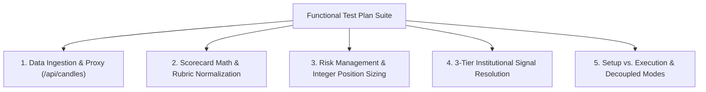

# Playbook Setups - Comprehensive Functional Test Plan & Verification Plan

**Document Version:** 2.0.0  
**Status:** Approved / Production-Current  
**Last Review:** September 2026  
**Target Domain:** Playbook Scoring, Risk Management, Quantitative Execution, Data Validation  

---

## Document Revision History

| Version | Date | Author / Team | Summary of Changes |
| :--- | :--- | :--- | :--- |
| **v1.0.0** | July 2026 | QA & Quant Engineering | Initial functional test matrix covering the 15 momentum setups and preliminary MOS models. |
| **v2.0.0** | September 2026 | Systems Architecture | Updated test specifications for live implementation: central memory proxy (`/api/candles`), integer share sizing enforcement, SQLite persistent journal verification, and standalone batch test scripts. |

---

## 1. Overview & Test Objectives
This test plan provides an efficient, rigorous functional verification framework for the **15 Playbook Setups** in the Aether Market Terminal. It validates end-to-end data integrity, scorecard mathematics, risk management parameters, multi-setup resolution logic, and mode decoupling across the architecture.



---

## 2. Core Subsystem Test Specifications

### A. Subsystem 1: Central Data Proxy & Cache (`/api/candles`)
- **Objective**: Verify that candlestick data and quotes for `1m`, `5m`, `15m`, and `1d` resolution are pulled correctly via the single backend proxy (`http://127.0.0.1:8080/api/candles`) and served in $< 1\text{ms}$ on memory cache hits ($< 120\text{s}$).
- **Validation Criteria**:
  1. `meta.regularMarketPrice` reflects live market / extended-hours spot price.
  2. `meta.previousClose` reflects yesterday's official session closing price (used for accurate Gap % calculation).
  3. Re-querying the same symbol within 120 seconds returns `CANDLE_CACHE` data instantly with zero outbound Yahoo Finance network requests.

### B. Subsystem 2: Scorecard Math & Rubric Normalization
- **Objective**: Ensure scorecard scoring models (**MOS-A**, **MOS-B**, **MOS-P**) calculate breakdown categories accurately and normalize the Scorecard Header title to match the sum of category bars.
- **Validation Criteria**:
  1. Sum of breakdown category scores (e.g. 4 categories out of 3.0 = 12.0 max) maps to normalized header score:
     $$\text{Normalized Score} = \left(\frac{\sum \text{Breakdown Categories}}{12.0}\right) \times 10.0$$
  2. The rendered score total in the UI header matches the sum of the category progress bars without rounding mismatches.

### C. Subsystem 3: Risk Management & Integer Position Sizing
- **Objective**: Validate direction-aware stop/target levels and strictly integer position sizing.
- **Validation Criteria**:
  1. **Strict Integer Shares**: Share size is floored using `Math.floor()` / `int()`. Zero fractional or floating shares.
  2. **Capital Ceiling Cap**: Position value cannot exceed 15% of total portfolio capital ($\le 0.15 \times \text{Portfolio}$).
  3. **Minimum Stop Floor**: Stop distance is clamped to $\ge \$0.50$ to prevent division-by-zero astronomical share sizes.
  4. **Direction Alignment**:
     - `LONG`: $\text{Stop} = \text{Entry} - \text{Dist}$, $\text{Target 1} = \text{Entry} + (\text{Dist} \times 1.5)$.
     - `SHORT`: $\text{Stop} = \text{Entry} + \text{Dist}$, $\text{Target 1} = \text{Entry} - (\text{Dist} \times 1.5)$.

### D. Subsystem 4: 3-Tier Institutional Multi-Setup Resolution
- **Objective**: Test directional confluence, opposing signal neutralization, and active trade auto-flattening.
- **Validation Criteria**:
  1. **Confluent Setups (Same Direction)**: Combined into 1 single position with +0.5 Confluence Score boost and Tier upgrade.
  2. **Opposing Signals in Scan ($|\Delta| < 1.5$)**: Signal neutralization. Saved to log as `CANCELLED_NEUTRAL`.
  3. **Opposing Active Position (`IN_TRADE` Reversal)**: High-conviction opposing setup ($\text{Score} \ge 8.5$) automatically **FLATTENS** open trade at market price and opens new position.

### E. Subsystem 5: Setup vs. Execution Separation & Mode Decoupled
- **Objective**: Ensure Tab 2 Scanner (Monitoring) vs Tab 3 Scanner Log (Auto DB Audit) vs Tab 1 Setup Journal (Manual Paper Trading) operate independently.
- **Validation Criteria**:
  1. Tab 2 displays individual setup scores and Merged Confluence Score cards with an **`⚡ EXECUTE MANUAL TRADE`** button.
  2. Auto-mode scanner runs ONLY write log entries to SQLite database (`POST /api/journal`) and NEVER touch paper trading balance or `p.positions`.
  3. Paper trading SELL orders validate that open holdings exist before executing.

---

## 3. Setup-by-Setup Functional Test Matrix (All 15 Playbook Setups)

| Setup ID & Name | Primary Timeframe | Score Model | Direction | Core Trigger Validation | Risk & Trailing Check |
| :--- | :--- | :--- | :--- | :--- | :--- |
| **1. Gap and Go** | **5m** | MOS-B | LONG | Premarket Vol $> 100\text{k}$, Gap $\ge 3.0\%$, RVOL $\ge 1.5$. | Stop at ORL, Trailing 5m 10-EMA. |
| **2. Gap and Fade** | **5m** | MOS-P | SHORT | Gap $\ge 3.0\%$, RVOL $< 1.0$, lower high reversal candle. | Stop at ORH, Trailing 5m 10-EMA. |
| **3. Episodic Pivot (EP)** | **1d / 5m** | MOS-B | LONG | Earnings/Catalyst Gap $\ge 5.0\%$, RVOL $\ge 2.5$. | Stop at LOD, Trailing 1d 9-EMA. |
| **4. High-Tight Flag (HTF)** | **1d / 5m** | MOS-B | LONG | $100\%+$ Gain in 4 weeks, flag consolidation breakout. | Stop at Flag Low, Trailing 1d 10-EMA. |
| **5. VWAP Hold & Re-Entry** | **5m** | MOS-P | LONG | Touch & hold VWAP, 5m green confirmation candle. | Stop below VWAP, Trailing VWAP. |
| **6. Parabolic Short** | **1d / 5m** | MOS-P | SHORT | 3+ Days extended above 20-EMA, 5m blow-off top. | Stop at Day High, Trailing 5m 10-EMA. |
| **7. Red-to-Green Shift** | **5m** | MOS-P | LONG | Reclaim yesterday's close + 5m green momentum. | Stop at Low of Day, Trailing 5m 10-EMA. |
| **8. Second Day Play** | **1d / 5m** | MOS-P | LONG | Day 1 high-volume expansion + Day 2 morning pullback hold. | Stop at Morning Low, Trailing 5m 10-EMA. |
| **9. Volatility Contraction (VCP)** | **1d** | MOS-A | LONG | 3+ Contractions on Daily chart + volume dry-up. | Stop at Pivot Low, Trailing 1d 20-EMA. |
| **10. 10/21 EMA Pullback** | **5m** | MOS-P | LONG | Pullback to 5m 10/21-EMA zone + bounce candle. | Stop below 21-EMA, Trailing 5m 10-EMA. |
| **11. 30-Min ORB** | **15m** | MOS-P | LONG | 30-Minute Opening Range High breakout + $4.0\times$ RVOL. | Stop at 30m Midpoint, Trailing VWAP. |
| **12. Standard 15-Min ORB** | **5m** | MOS-B | LONG | 15-Minute Opening Range High breakout + $1.5\times$ RVOL. | Stop at ORL Midpoint, Trailing VWAP. |
| **13. Blue Sky ATH Breakout** | **1d** | MOS-B | LONG | Breakout above 30-day/52-week High + $1.2\times$ RVOL. | Stop at 10-EMA, Trailing 1d 10-EMA. |
| **14. Stage 1 to 2 Base Reversal**| **1d** | MOS-A | LONG | Base breakout above 200-day SMA after 60+ days below. | Stop at Base Support, Trailing 1d 50-SMA. |
| **15. PEAD Breakout** | **1d** | MOS-B | LONG | Post-Earnings drift consolidation breakout + $1.2\times$ RVOL. | Stop at Consolidation Support. |

---

## 4. Execution & Verification Plan

### A. Automated Verification Scripts

#### 1. Mathematical Logic & Options GEX Test
```bash
.\validate_calculations.bat
# Equivalent direct execution:
uv run --python 3.12 --with pandas --with numpy --with yfinance algo-engine/verify_playbook_calculations.py
```
- Validates RVOL Time-Slice mathematical formulas against theoretical baselines.
- Validates synthetic Options Chain GEX levels (Call Wall, Put Wall, GEX Flip).
- Executes live live-market query for `SPY` options chain and confirms regime determination.

#### 2. Milestone 2 Backtester & Parameter Sweep Test
```bash
.\validate_backtester.bat
# Equivalent direct execution:
uv run --python 3.12 --with pyyaml --with pandas --with numpy --with yfinance python algo-engine/verify_milestone_2.py
```
- Validates `PlaybookBacktester` historical simulation on `NVDA` for `setup_12` (Standard ORB).
- Validates `SetupParameterOptimizer` grid-search parameter sweep and output statistics.

### B. Manual UI Verification Steps
1. **Universal Scanner (Tab 2)**: Click **RUN UNIVERSAL SCAN**. Confirm candidate tickers display individual setup badges, Merged Confluence Score, and **`⚡ EXECUTE MANUAL TRADE`** button.
2. **Setup Journal (Tab 1)**: Inspect Today's Triggers and Saved Logs. Confirm that page navigation (◀ / ▶) pages through SQLite database records correctly.
3. **Status Toggle**: Change status dropdown on any saved log between `Win`, `Loss`, and `Pending` and verify instant persistence.
4. **Paper Trading**: Attempt a SELL order on a ticker without holdings. Verify that execution is blocked with `"You do not hold any open shares."`