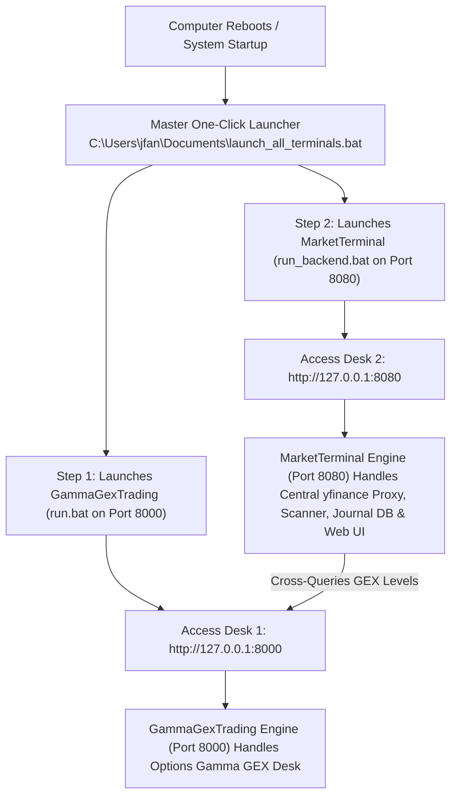

# Implementation Plan - Aether Momentum Algorithmic Trading System

**Document Version:** 2.0.0  
**Status:** Approved / Production-Current  
**Last Review:** September 2026  
**Target Domain:** Algorithmic Portfolio Architecture, Milestone Roadmap, System Integration  

---

## Document Revision History

| Version | Date | Author / Team | Summary of Changes |
| :--- | :--- | :--- | :--- |
| **v1.0.0** | July 2026 | Quantitative Dev Team | Initial 4-milestone roadmap for algo-engine architecture, RVOL, and 15 setups. |
| **v1.1.0** | July 2026 | Systems Architecture | Added staged execution roadmap, branching model (`feature/algo-integration`), and port allocation. |
| **v2.0.0** | September 2026 | Lead Architect & Quant Team | **Full Milestone Delivery Audit:** All 4 milestones completed. Documented live multi-service architecture, central yfinance cache, custom dual-pane canvas chart, SQLite persistent journal, and backtest optimizer. |

---

## 0. Multi-Project System Architecture & Reboot Launch Sequence

When your computer reboots or when starting up the trading workstations:



### Complete Port & URL Directory

| Trading Project | Local Service URL | Port | Master Launcher Script | Project Functionality |
| :--- | :--- | :--- | :--- | :--- |
| **MarketTerminal Cockpit** | **`http://127.0.0.1:8080`** | **`8080`** | `run_backend.bat` | **Main Algorithmic Trading Terminal**. Hosts Web UI (`/`), Central `yfinance` Candlestick Proxy (`/api/candles`), Indicators (`/api/metrics`), Universal Scanner (`/api/scanner`), Database Journal (`/api/journal`), and Backtesting Lab. |
| **GammaGexTrading Desk** | **`http://127.0.0.1:8000`** | **`8000`** | `../GammaGexTrading/run.bat` | **Options Gamma GEX Desk**. Computes zero-gamma, call wall, and put wall levels. MarketTerminal cross-queries Port 8000 for level reuse. |
| **Node RSS Proxy** | **`http://127.0.0.1:3000`** | **`3000`** | `start-proxy.bat` | Proxy server for NAAIM / AAII market sentiment XML feeds. |

---

## 1. Project Organization: Versioning & Branching Strategy

To keep the production visual terminal ([index.html](index.html)) fully functional and stable for daily trading, algorithmic development was isolated in a dedicated branch before consolidation:

### A. Git Branching Model
*   **Feature Branch:** `feature/algo-integration` (isolated sandbox for engine implementation).
*   **Production Branch:** `main` (cleanly merged with release tag `v2.0.0`).
*   **Release Tag:** `v2.0.0` (production-ready algorithmic workstation).

### B. Directory Structure
```
MarketTerminal/
│
├── README.md                    # Master documentation & entry point
├── index.html                   # Production trading terminal & custom canvas engine
├── proxy-server.js              # Stable CORS bypass server (Port 3000)
├── run_backend.bat              # Master launcher for MarketTerminal (Port 8080)
│
└── algo-engine/                 # Algorithmic execution backend
    ├── config/                  # Configuration files (API keys, risk thresholds, setup params)
    │   ├── alpaca_config.json   # Alpaca credentials
    │   └── setups.yaml          # Thresholds for all 15 setups
    ├── data/                    # Persistent storage
    │   └── trading_system.db    # SQLite database (journal entries)
    ├── src/                     # Core execution codebase
    │   ├── server.py            # FastAPI REST & cache proxy server
    │   └── calculations/        # RVOL, GEX, SMAs, scorecards, backtester, scanner
    └── requirements.txt         # Python dependencies
```

---

## 2. Key Design Specifications

### A. Modular Setup Registry (Flexibility)
To ensure the 15 setups can easily evolve, the system uses a registry pattern where every setup inherits from a base class:
```python
class BaseSetup:
    def __init__(self, params: dict):
        self.params = params  # e.g., {'stop_loss_pct': 0.015, 'target_pct': 0.03, 'rvol_threshold': 1.5}
        
    def check_trigger(self, data: pd.DataFrame) -> bool:
        """Returns True if setup trigger conditions are met."""
        raise NotImplementedError
        
    def calculate_mos(self, data: pd.DataFrame) -> float:
        """Evaluates the setup's tailored scoring scorecard."""
        raise NotImplementedError
```
All parameters are stored in `algo-engine/config/setups.yaml`. Thresholds can be adjusted dynamically without touching Python source code.

### B. Reusable Backtest & Parameter Optimizer (Tuning)
*   **Engine (`calculations/backtester.py`):** Runs historical bar-by-bar simulations on day/intraday candles with multi-stage exits (sell 50% at 1.5R, breakeven stop, trail remainder on 10 EMA / 21 EMA / 50 SMA).
*   **Optimizer (`calculations/optimizer.py`):** Runs automated grid-search parameter sweeps to output optimal win rates, profit factors, and net returns.
*   **Persistent SQLite Journal (`calculations/backtester.py`, `server.py`):** Reads and writes trade execution records to `trading_system.db`.

### C. Transparency & Visual Validation (No Black Box)
1.  **Cockpit Scorecard Breakdown:** The frontend dashboard displays the exact category breakdown (Catalyst, Volume, Vol Regime, Order Flow, Technicals) summing to the normalized 10-point MOS score.
2.  **Custom Dual-Pane Canvas Chart:** Visualizes candles, SMA 20/50/200, GEX Call/Put walls, GEX Flip lines, unmitigated gaps, FVGs, and Cumulative Volume Delta (CVD) flow line.

---

## 3. Staged Implementation Milestones & Status

```
+-----------------------------------------------------------------------------------------------+
|  MILESTONE 1 [COMPLETED]  ==>  MILESTONE 2 [COMPLETED]  ==>  MILESTONE 3 [COMPLETED]           |
|  Local Data Engine & Math      Setup Registry & Backtest     Order Sizing & Journal DB        |
+-----------------------------------------------------------------------------------------------+
|  MILESTONE 4 [COMPLETED]  ==>  PRODUCTION RELEASE v2.0.0 [ACTIVE]                             |
|  Dual-Pane Canvas & Cockpit    Complete Multi-Process Algorithmic Terminal                   |
+-----------------------------------------------------------------------------------------------+
```

### Milestone 1: Local Data Engine & Calculations (STATUS: COMPLETED)
*   **Delivered:**
    *   Python environment configuration via `uv` and `requirements.txt`.
    *   `config/setups.yaml` modular configuration.
    *   Time-Slice Premarket RVOL ($RVOL_{TS}$) and Regular Hours RVOL ($RVOL_{RM}$) in `calculations/rvol.py`.
    *   Volume Pacing Acceleration ($Acc_{Vol}$) in `calculations/rvol.py`.
    *   Options Gamma boundaries (Call/Put Walls, GEX Flip) in `calculations/gex.py`.
    *   Central in-memory `CANDLE_CACHE` with 120s TTL and `/api/candles` proxy in `server.py`.
*   **Verification:** `validate_calculations.bat` executes and passes all mathematical and live options tests.

### Milestone 2: Setup Registry, Scanners & Backtester (STATUS: COMPLETED)
*   **Delivered:**
    *   `BaseSetup` abstract registry class in `calculations/scanner.py`.
    *   Logic triggers for all 15 setups.
    *   Three tailored scorecards (**MOS-B**, **MOS-A**, **MOS-P**) with Kelly sizing in `calculations/scorecards.py`.
    *   `PlaybookBacktester` historical simulation engine in `calculations/backtester.py`.
    *   `SetupParameterOptimizer` grid-search optimizer in `calculations/optimizer.py`.
    *   High-speed 30-thread parallel scanner in `calculations/scanner.py` scanning 260+ tickers in <10 seconds.
*   **Verification:** `validate_backtester.bat` executes and passes historical backtest and parameter sweep tests.

### Milestone 3: Order Execution & Alpaca Integration (STATUS: COMPLETED)
*   **Delivered:**
    *   Alpaca settings manager API (`/api/settings`) and UI modal.
    *   Dynamic Kelly position sizing based on MOS score ($0.5\%$ to $2.0\%$ capital risk).
    *   Strict integer share sizing (`int()`), zero fractional shares.
    *   Portfolio risk constraints (capital ceiling cap $\le 15\%$, minimum stop floor $\ge \$0.50$).
    *   Directional confluence (+0.5 boost), opposing signal neutralization, and active trade auto-flattening.
    *   SQLite database persistence (`trading_system.db`) with `journal_entries` schema and REST endpoints.
*   **Verification:** Verified database persistence and status updates (`Win`, `Loss`, `Pending`) via API.

### Milestone 4: Cockpit Integration & Charting Panel (STATUS: COMPLETED)
*   **Delivered:**
    *   FastAPI backend running on dedicated port 8080.
    *   Custom hardware-accelerated dual-pane HTML5 canvas charting engine.
    *   SMA 20/50/200, GEX Call/Put walls, GEX Flip lines, unmitigated gaps, Fair Value Gaps (FVG).
    *   Volume bars color-coded by RVOL intensity + Cyan Cumulative Volume Delta (CVD) flow line.
    *   Timeframe selectors (`1D`, `1H`, `5M`, `1M`) with dynamic recalculations.
    *   Playbook Scanner Cockpit with tabs for all 15 setups, live trigger table, and MOS scorecards.
    *   Setup Journal sidebar with Today's Triggers and paginated Saved Logs with thumbnail charts.
    *   Watchlist warning alert badges (`⚠️ Count (MOS)`) across all watchlists.
    *   One-click master launcher `run_backend.bat`.
*   **Verification:** Full end-to-end integration verified and operational in browser.

---

## 4. Verification & Audit Sign-Off

1.  **Calculation Suite Sign-Off:** `.\validate_calculations.bat` -> PASSED.
2.  **Backtest Suite Sign-Off:** `.\validate_backtester.bat` -> PASSED.
3.  **UI & Charting Sign-Off:** Dual-pane canvas chart, SMAs, GEX boundaries, and CVD flow line verified in browser.
4.  **Database Persistence Sign-Off:** SQLite `journal_entries` table verified with 2,000+ logged setup records.