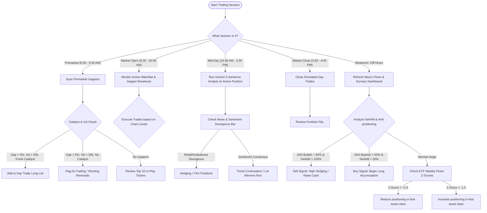

# Aether Market Terminal - Professional User Guide & Decision Workflows

Welcome to the Aether Market Terminal user guide. This document explains the purpose, key metrics, and strategic actions associated with every widget in [index.html](file:///c:/Users/jfan/Documents/MarketTerminal/index.html).

---

## 0. Where is the Artifact Directory?
The Antigravity system maintains an isolated **artifact directory** outside of your local project folders to store conversation logs, temporary work files, and system outputs. It is located at:
`C:\Users\jfan\.gemini\antigravity\brain\019824b9-a81b-49c4-a5a2-11883290fad3\`

However, to make this guide easy to access alongside your code, **this copy has been saved directly in your main project folder** at [userguide.md](file:///c:/Users/jfan/Documents/MarketTerminal/userguide.md).

---

## 1. Widget Catalog: What to Look For & How to Use

### Watchlist Widget
* **Key Metrics:** Live-ticking prices, daily percentage changes, and relative volume for major index ETFs and highly liquid tickers.
* **Interpretation:**
  - Click any ticker (e.g., `SPY`, `NVDA`, `QQQ`) to load it into the active chart, trade terminal, and news filters.
  - Click the **Symbol** column header to toggle alphabetical sorting.
* **Decision Support:** Identifies which major benchmarks are leading or lagging. Use `SPY` and `QQQ` to assess general market direction before taking stock-specific trades.

### Premarket Gappers
* **Key Metrics:** Stocks gapping up by more than 5% pre-market on high volume (>50,000 shares), along with their **catalyst headlines**.
* **Interpretation:**
  - Click the **Refresh** icon to run a scan. The scraper pulls daily gainers from Yahoo Finance, filters them, and extracts the latest news catalyst.
  - **Fresh Catalyst (<24h):** High probability of breakout continuation.
  - **No Catalyst / Faded News:** High probability of a "gap-and-crap" reversal where the stock fades after the open.
* **Decision Support:** Use to build a day-trading watchlist before the market open.

### Top 10 In-Play List
* **Key Metrics:** The top 10 stocks currently commanding institutional attention and volume, accompanied by their active catalyst.
* **Decision Support:** Focus on these tickers for day-trading and swing-trading liquidity. High-volume in-play stocks offer the cleanest technical patterns and tightest bid-ask spreads.

### TradingView Widget / Fallback Canvas Chart
* **Key Metrics:** Price candles, support/resistance levels, and moving average trends.
* **Decision Support:** Wait for price to approach key technical levels (e.g., support/resistance or moving averages) identified on the chart before executing trades in the Trade Terminal.

### Trade Terminal
* **Key Metrics:** Order side (BUY/SELL), share quantity, estimated order cost, and cash balance warning flags.
* **Decision Support:** Practice position sizing. Never commit more than 5-10% of your total portfolio value to a single high-beta stock trade.

### Portfolio & History Tabs
* **Key Metrics:** Open positions, average purchase cost, current market price, and unrealized profit & loss (P&L).
* **Decision Support:** Cut losing positions when they violate your risk parameters (e.g., -5% from average cost) and let winners run toward technical resistance levels.

### Gemini Institutional Analyst (3-Sentence Read)
* **Key Metrics:** A concise, professional qualitative reading of the active stock's price action, primary risk factors, and critical levels.
* **Decision Support:**
  - **Sentence 1 (Momentum):** Identifies if the trend is institutional accumulation or retail distribution.
  - **Sentence 2 (Risk):** Flags the main threat. Use this to set stop-losses.
  - **Sentence 3 (Catalysts/Levels):** Flags target zones. Use these to set limit sell orders.

### Multi-Feed News Stream & Sentiment Meter
* **Key Metrics:** The tone of news items and the ratio of Bullish vs. Bearish articles.
* **Decision Support:**
  - **Positive Sentiment Bar (Bullish > 60%):** Risk-on environment. Focus on long breakout trades.
  - **Negative Sentiment Bar (Bearish > 60%):** Risk-off environment. Raise cash or increase short hedges.

### Institutional vs. Retail Sentiment Divergence Meter
* **Key Metrics:** Divergence between mainstream institutional reporting (WSJ/CNBC) and retail sentiment (Reddit).
* **Decision Support:**
  - **Bullish/Bearish Consensus:** Institutional and retail align. High conviction trend continuation.
  - **Divergence (e.g., Retail Bullish / Institutional Bearish):** Retail is chasing a bounce, but institutions are selling. Signals a high probability of a bull trap and eventual breakdown.

### Macro Flow & Surveys Dashboard
* **Key Metrics:** AAII Retail Sentiment, NAAIM exposure, UMich Consumer Sentiment, and computed Weekly ETF flows.
* **Decision Support:**
  - **Weekly Fund Flows:** Displays Z-Scores and Reversal signals (e.g., `Eq: Z: +0.24 (Bullish Reversal)`).
    - **Z-Score > +1.5:** Extremely crowded longs. High selloff risk.
    - **Z-Score < -1.5:** Extremely oversold capitulation. Strong dip-buying zone.
    - **Bullish/Bearish Reversal:** Signal turning points. Time entries when flows change signs.
  - **NAAIM Exposure:**
    - **Exposure > 100%:** Fund managers are fully leveraged. High pull-back risk.
    - **Exposure < 30%:** Fund managers are heavily hedged. Favorable risk-reward for long entry.
  - **AAII Survey:**
    - **Bullish > 50%:** Extreme retail optimism. Contrarian sell signal.
    - **Bearish > 50%:** Extreme retail pessimism. Contrarian buy signal.
  - **Systemic Macro Index (SMI):** Composite indicator combining VIX volatility and market surveys into a single normalized index.

---

## 2. Trading Session Routine: When and How Often to Use

| Session / Time | Focus Area | Dashboard Widget to Check | Objective / Trading Action |
| :--- | :--- | :--- | :--- |
| **Premarket** *(8:00 - 9:30 AM EST)* | Catalyst discovery & gap scan | Premarket Gappers, Top 10 In-Play | Identify gapping stocks with fresh catalysts; build watchlist; plan entry levels. |
| **Market Open** *(9:30 - 10:30 AM EST)* | Technical execution & momentum | Charting, Trade Terminal | Execute watchlist breakouts; set stop-losses; avoid trading high-spread items. |
| **Mid-day** *(10:30 AM - 3:30 PM EST)* | Position management & sentiment monitoring | Institutional vs. Retail Sentiment, Gemini Analyst | Run the 3-Sentence Analyst on open positions; check for sentiment divergence; trim winners. |
| **Market Close** *(3:30 - 4:00 PM EST)* | Bookkeeping & daily wrap-up | Portfolio & History tabs | Close simulated day trades; document trading performance in the History logs. |
| **Weekend / Weekly Close** *(Friday pm - Sunday)* | Macro positioning & regime analysis | Macro Flow & Surveys (AAII, NAAIM, Weekly flows) | Assess fund manager exposure (NAAIM) and weekly flow Z-scores; formulate next week's macro bias. |

---

## 3. Institutional Decision Flowchart

Below is a decision-making tree indicating how to compile information from the widgets to execute low-risk trades.

